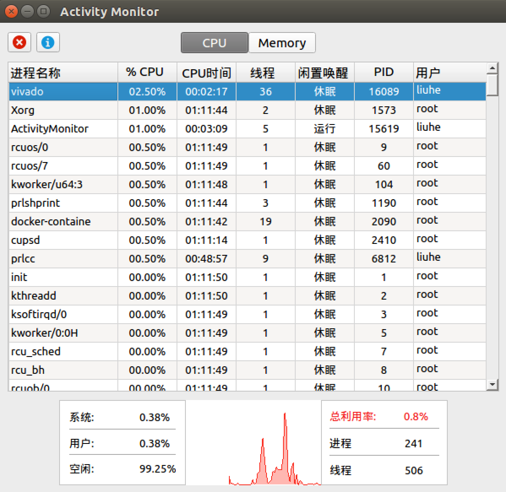
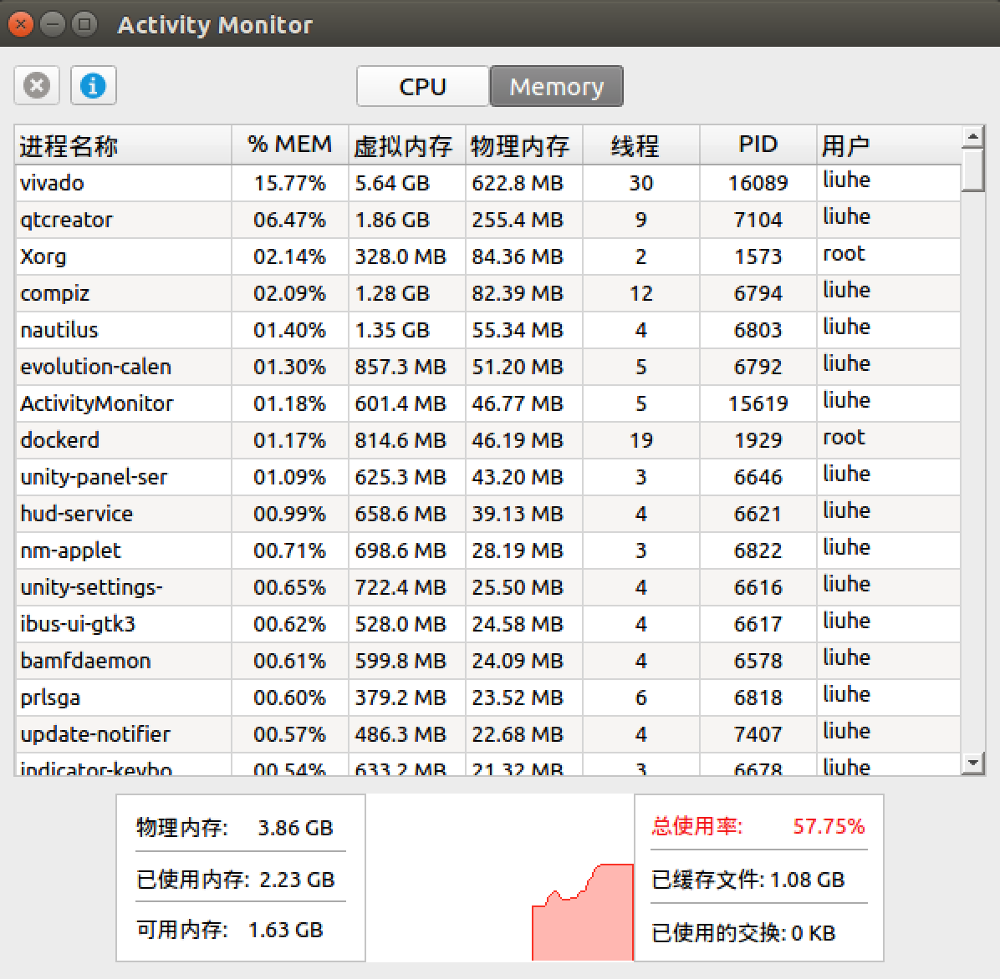
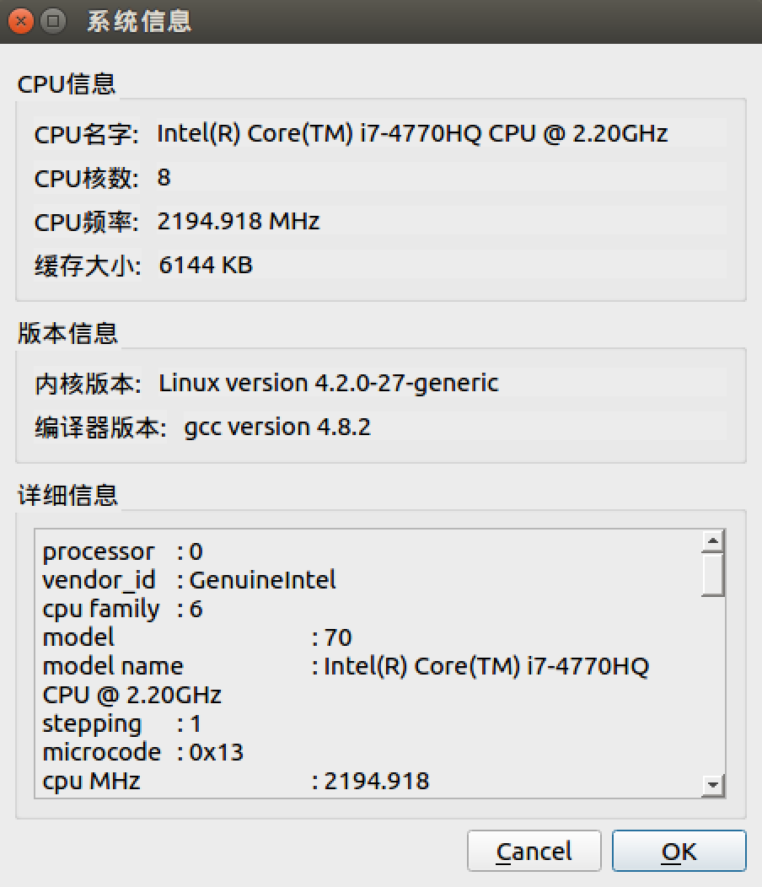

# Linux Activity Monitor

This application is able to monitor each process's cpu and memory utilization, cpu time, state, PID and user information by analyzing Linux/Unix's `\proc` virtual file sysyem. It can also display the overall information of cpu and memory use ratio, as well as the basic information of the machine.

The project is written in C++ with Qt4.

## Screenshots

* CPU information

* Memory information

* Basic system information

